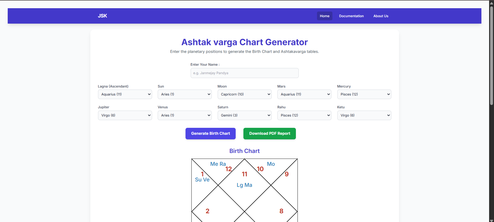

# Ashtakavarga Chart Generator

A web-based astrology tool that calculates **Ashtakavarga Bindu values**, generates a **North Indian style Birth Chart**, and automatically produces a **PDF report** based on planetary positions.

This project follows classical Vedic astrology rules to compute **Ashtakavarga tables** and visualize planetary placements in a chart format.

---
## 🌐 Live Demo

🚀 https://jsk-ashtakvarga.pages.dev/

---

## Features

* Generate **Birth Chart (Kundli)** using planetary positions
* Automatic **Ashtakavarga Bindu calculation**
* **North Indian style chart layout**
* **PDF report generation**
* Simple **UI for entering planetary positions**
* Detailed **documentation explaining calculation rules**

---

## Project Preview



---

## Input Parameters

Users can enter the following planetary positions:

* Lagna (Ascendant)
* Sun
* Moon
* Mars
* Mercury
* Jupiter
* Venus
* Saturn
* Rahu
* Ketu

Each planet is selected with its corresponding **Rashi (Zodiac sign)**.

---

## How It Works

1. User enters planetary positions.
2. The application generates the **Birth Chart**.
3. Ashtakavarga bindu values are calculated based on classical rules.
4. The result is displayed visually.
5. A **PDF report** can be downloaded.

---

## Technologies Used

* **HTML**
* **CSS**
* **JavaScript**
* **PDF generation library**

---

## Installation

Clone the repository:

```bash
git clone https://github.com/yourusername/ashtakavarga-chart-generator.git
```

Open the project folder:

```bash
cd ashtakavarga-chart-generator
```

Run the project by opening:

```
index.html
```

in your browser.

---

## Documentation

The repository contains a **documentation section explaining the rules used for Ashtakavarga calculations**, including:

* Bindu calculation rules
* Planetary contribution logic
* Zodiac sign mapping

These rules are based on classical **Vedic astrology texts and traditional Ashtakavarga principles**.

---

## Future Improvements

* Full **Ashtakavarga table visualization**
* **Sarvashtakavarga calculation**
* Export charts in **multiple formats**
* Add **date, time, and location based automatic planetary calculations**

---

## Author

**Janmejay Pandya**

Astrology enthusiast and developer exploring the intersection of **Vedic astrology and software development**.


